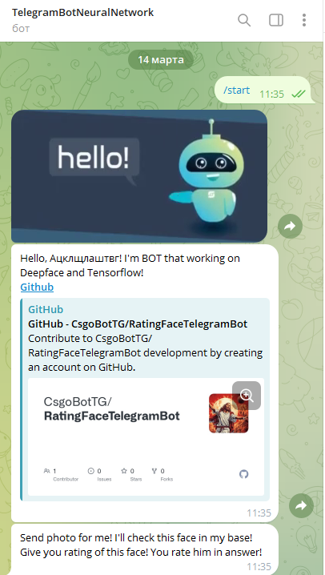
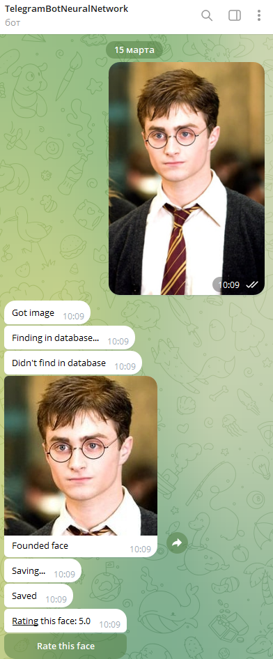
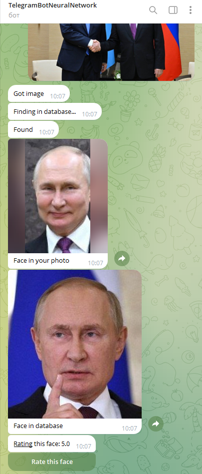

<h1 align="center">Rating Faces with Telegram BOT on <u><b><a href="https://github.com/serengil/deepface" target="_blank">DeepFace</a><b></u></h1>
<p align="center"><a href="https://git.io/typing-svg"></a></p>

<h3 align="center">Send your face to this bot in the form of a photo. He will check it in the database. You will send a face assessment.</h3>
<h2 align="center"><u>A lot of people. A lot of faces. A lot of ratings.</u></h2>

# Installation (Windows/Linus/Mac)
```shell
$ git clone https://github.com/CsgoBotTG/RatingFaceTelegramBot.git
$ cd RatingFaceTelegramBot/bot
$ pip install -r requirments.txt
```

# Usage (Windows/Linus/Mac)
```shell
$ cd RatingFaceTelegramBot/bot/src
$ python main.py -token YourToken
```

# Examples
### Start

### New face

### Found face
